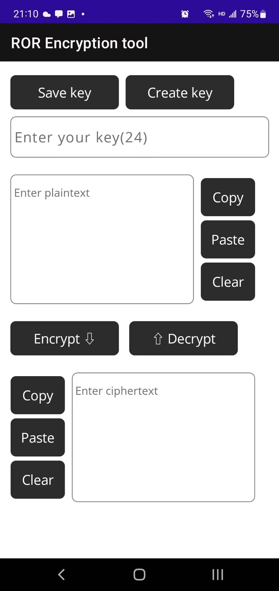

# ROR-Encryption
This is a tool I made when I was a primary school student, unfortunately it has been deleted by me. I'm restoring it.    
 
first remake：
http://anan.i234.me:7777/ror/res/encryption/ROR-E.apk    

I really don't know how MAUI does layout adaptation. If you use a widescreen device, it may mess up the UI.And MAUI makes the file size large.I think it's a very bad remake, so I might do it with other UI frameworks in the future.
In general case it will be like this：    

